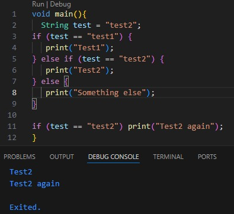
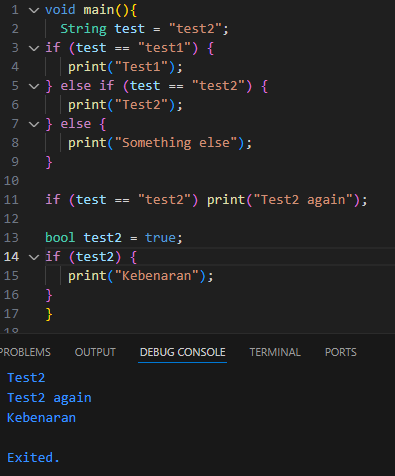
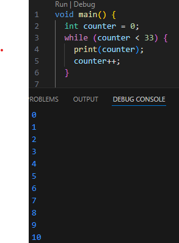
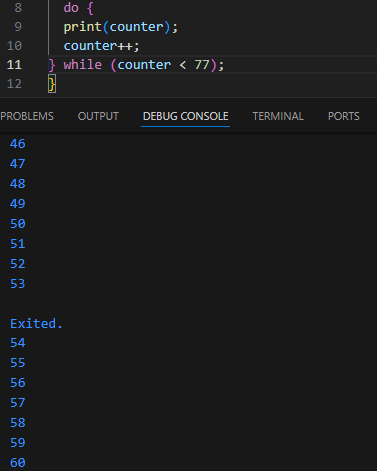
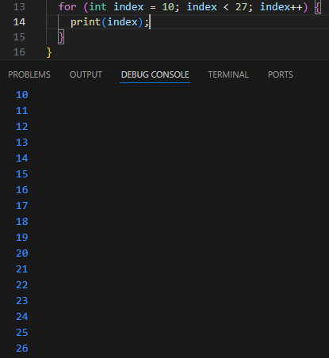
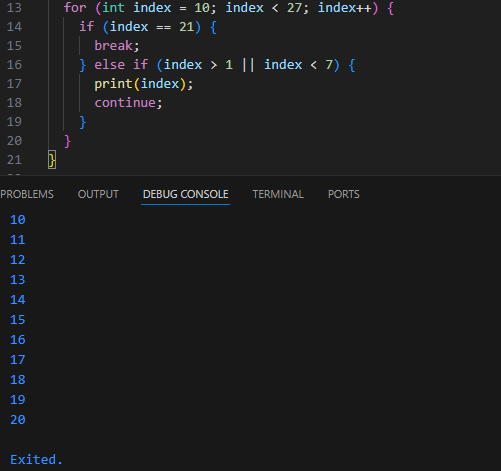
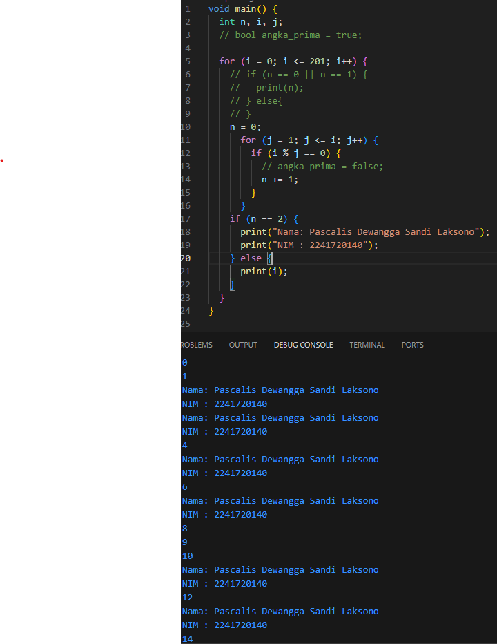

## Dokumentasi Jobsheet 2

# Praktikum 1
1. Langkah 1
>
>> Hasil running tersebut terjadi karena variable test berisi "test2".
2. Langkah 2
>
>> Perbaikan yang dilakukan adalah dengan mendefinisikan tipe data boolean sehingga variable dapat dibandingkan secara langsung.

# Praktikum 2
1. Langkah 1
>
>> Terdapat sedikit error karena variable counter belum terdefinsi
2. Langkah 2
>
>> Perbedaan yang terdapat dibandingkan dengan while pada langkah 1, do while mengeksekusi pertama kali tanpa mengecek kriteria yang dibuat, sedangkan while biasa mengeksekusi persyaratan terlebih dahulu seperti perulangan for.

# Praktikum 3
1. Langkah 1
>
>> Error yang terjadi dikarenakan tipe data variable index tidak terdefinisi, kemudian terjadi infinite loop karena tidak terdapat increment value index sehingga tidak dapat sampai pada ketentuan yang diberikan.
2. Langkah 2
>
>> Error yang terjadi dikarenakan tidak terdapat perintah print sebelum continue, sehingga yang terjadi bilangan tidak ter-print karena di skip.

# Tugas
- Membuat program yang dapat menampilkan bilangan prima dari angka 0 sampai 201 menggunakan Dart. Ketika bilangan prima ditemukan, maka tampilkan nama lengkap dan NIM.
>

