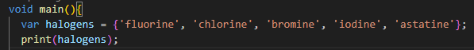
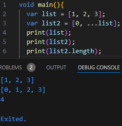

## Praktikum

# Praktikum 1
  *Langkah 2*
> 
  Pertama dilakukan pengecekkan isi list, kemudian di print secara bertahap.
  *Langkah 3*
 >
  Diperlukan deklarasi tipe data list yang jelas supaya tidak ambigu.

# Praktikum 2
  *Langkah 2*
 
  Mengeksekusi print sebuah dataset berisi halogen
  *Langkah 3.1*
 
  pada variable names3 tidak menampilkan apapun dikarenakan variable tersebut hanya sebuah map.
  *Langkah 3.2*
 
  Berhasil menampilkan set nama dan nim.

# Praktikum 3
  *Langkah 2*
 
  mengeksekusi print sesuai data yang dibuat
  *Langkah 3.1*
 
  Hasil print yang diberikan sesuai dengan mapping yang diubah
  *Langkah 3.2*
 
  Penambahan dilakukan pada variable gifts dan nobleGases, beserta perubahan isi sesuai mapping.

# Praktikum 4
  *Langkah 2*
 
  List diprint secara terpisah, variable list2 berisi list1.
  *Langkah 3.1*
 
  Tereksekusi dengan baik
  *Langkah 3.2*
 
  mengganti dengan Nama dan NIM.
  *Langkah 4*
 
  Variable promoActive harus dideklarasikan menggunakan tipe data bool supaya bisa dipanggil.
  *Langkah 5*
 
  Variable login harus dideklarasikan menggunakan tipe data string supaya bisa dilakukan perbandingan kondisi.
  *Langkah 6*
 
  Tereksekusi dengan baik.

# Praktikum 5
  *Langkah 2*
 
  Kode tereksekusi dengan baik.
  *Langkah 3*
 
  Terdapat sedikit perubahan pada main supaya bisa sesuai dengan tipe data funtion yang ditetapkan.
  *Langkah 4*
 
  Var mahasiswa memerlukan deklarasi isi supaya dapat diprint.
  *Langkah 5*
 
  Kode berhasil dieksekusi.

# Tugas
1. Jelaskan yang dimaksud Functions dalam bahasa Dart!
>> Function adalah sekumpulan kode yang nantinya akan dipanggil ke dalam main bila dibutuhkan.
2. Jelaskan jenis-jenis parameter di Functions beserta contoh sintaksnya!
>> Parameter adalah kondisi atau persyaratan yang harus dipenuhi untuk menjalankan function tersebut, biasanya berbentuk value dengan tipe data tertentu dan dideklarasikan bersamaan dengan nama functionnya.
- (int, int) tukar((int, int) record) {
  var (a, b) = record;
  return (b, a);
} 
3. Jelaskan maksud Functions sebagai first-class objects beserta contoh sintaknya!
>> Artinya fungsi dapat diperlakukan seperti obyek lainnya seperti disimpan variable, dikembalikan sebagai hasil fungsi lain, dsb.
4. Apa itu Anonymous Functions? Jelaskan dan berikan contohnya!
>> Function yang tidak memiliki nama, biasanya digunakan untuk operasi sekali pakai. Contoh: Lambda
5. Jelaskan perbedaan Lexical scope dan Lexical closures! Berikan contohnya!
>> - Lexical Scope: konsep di mana ruang lingkup variabel ditentukan berdasarkan posisi kode dalam struktur program.
>> - Lexical Closure: terjadi ketika sebuah fungsi didefinisikan di dalam fungsi lain dan "mengingat" variabel dari lingkungan luarnya meskipun fungsi luar telah selesai dieksekusi. 
6. Jelaskan dengan contoh cara membuat return multiple value di Functions!
>> Dart menyediakan funciton untuk mengembalikan nilai lebih dari satu menggunakan List atau Map.

 